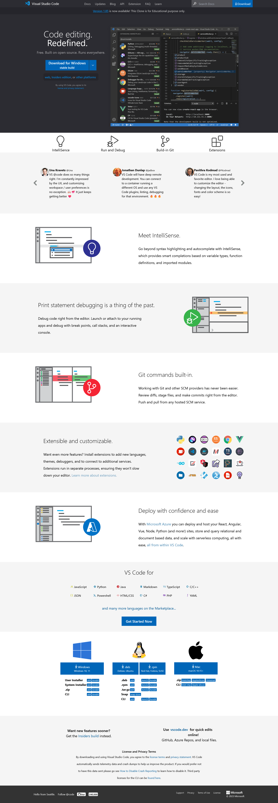

Here is a README.md file tailored for your Visual Studio Code website clone project on GitHub:

# VS Code Website Clone 

This is a clone of the [Visual Studio Code](https://code.visualstudio.com/) website's front page design built with HTML, CSS and the Tailwind CSS CDN.

## About This Project

I built this clone to practice:

- Using Tailwind CSS for styling
- Structuring content with semantic HTML
- Implementing a responsive layout with Flexbox

The goal was to recreate the overall visual design system and layout of the real VS Code homepage.

## Usage

To view the site locally:

1. Clone this repo
2. Open index.html in your browser

Since this project uses the Tailwind CDN, there are no dependencies to install. 

## Customizing / Extending This Project

Some ideas for ways to make this project more your own:

- Swap out the placeholder content for your own text 
- Change the color scheme by modifying Tailwind config
- Add new sections or pages  
- Convert it into a template/theme for another type of site
- Integrate tools like Webpack to extend build process

Since your project also includes output images, here are a few more sections I would add to the README:

## Output Images

The output/ directory contains output screenshots of the website:

### Full Screen

### Output

 

 
 
 
 
 

## Credits

Website design modeled after [code.visualstudio.com](https://code.visualstudio.com/). Page built for educational purposes only.
